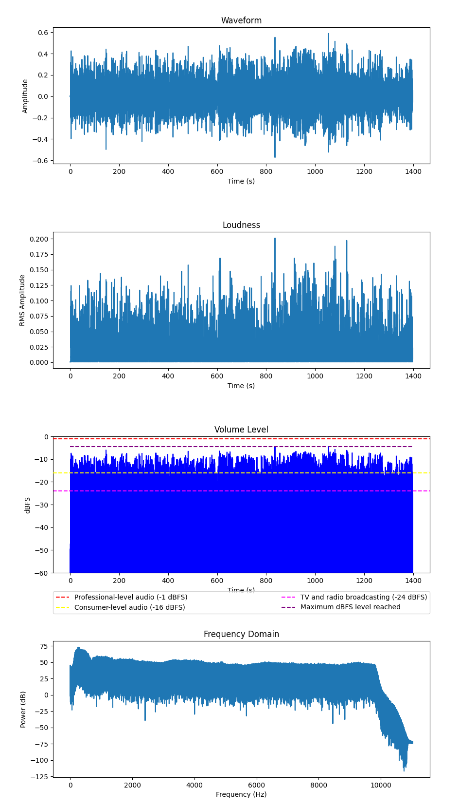
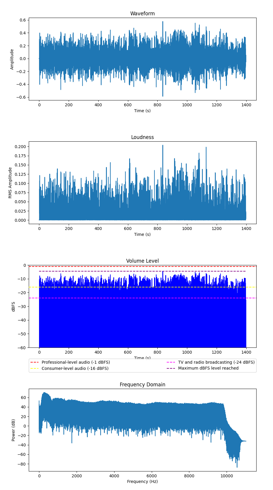
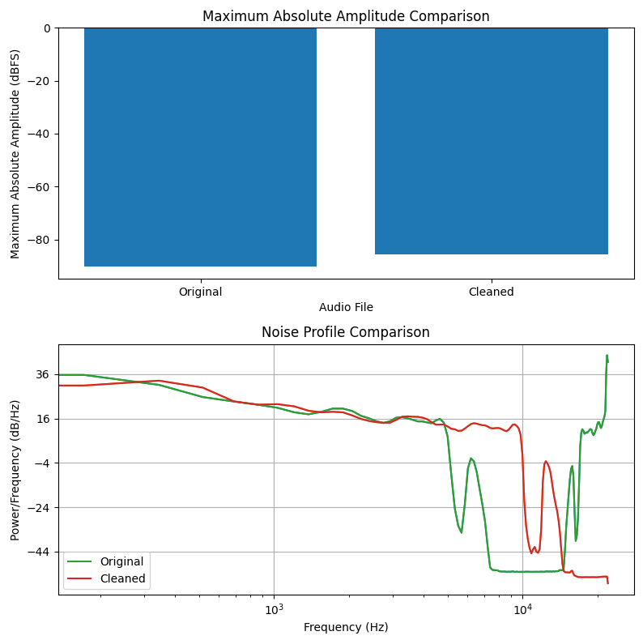

# Audio Fixer

- [Audio Fixer](#audio-fixer)
  - [The Problem](#the-problem)
  - [Visualization](#visualization)
    - [Original File](#original-file)
    - [Original File Sample](#original-file-sample)
    - [Cleaned File](#cleaned-file)
    - [Cleaned File Sample](#cleaned-file-sample)
    - [But They are the Same](#but-they-are-the-same)
  - [Code](#code)
  - [Definitions](#definitions)
    - [What is dBFS?](#what-is-dbfs)
    - [Maximum Absolute Amplitude](#maximum-absolute-amplitude)


## The Problem

My wonderful Chinese teacher sent me a full radio reading of Harry Potter (哈利波特) but it sounded... well... terrible. I could barely listen to it.

## Visualization

### Original File



Generated with [this code](visualize_audio.py)

This is an analysis of the original audio file. The most indicative graph is #3 where 0 is the loudest possible sound the audio format will accept. As you can see, a high percentage of the original audio file was getting close to 0 so it sounded *very* loud.

### Original File Sample

[This is the first chapter unfiltered](audio_files/1_HP-01-[AudioTrimmer.com].mp3)

### Cleaned File



Generated with [this code](visualize_audio.py)

### Cleaned File Sample

[This is the first chapter cleaned](audio_files/1_HP-01-[AudioTrimmer.com]_cleaned.mp3)

### But They are the Same

Yes, because we maintained the audio characteristics of the file largely the same, the dynamic range and the relative amplitude are the same. However, if you compare the noise and the absolute amplitude you can see that they have changed.



Generated with [this code](compare_absolute_amplitude.py)

In the lower chart you can see how the green line rockets upward. That is the background hum you hear in the original audio file.

## Code

The code uses spectral subtraction to identify the noise and remove it and also scales down the absolute amplitude toning down some of the parts of the audio that were painfully loud. It is multithreaded so that it can process up to 10 audio files at a time.

```python
import os
import argparse
import numpy as np
import librosa
import soundfile as sf
from pydub import AudioSegment
import logging
import concurrent.futures

# Set up logging
logging.basicConfig(level=logging.INFO)

# Define argument parser
parser = argparse.ArgumentParser(description='Apply spectral subtraction and normalization to all audio files in a directory and save the processed files in a new directory.')
parser.add_argument('input_dir', type=str, help='Input directory containing the audio files to be processed.')
parser.add_argument('output_dir', type=str, help='Output directory to save the processed audio files.')
args = parser.parse_args()

# Create the output directory if it doesn't exist
os.makedirs(args.output_dir, exist_ok=True)


def process_audio_file(audio_file_path):
    # Load the audio file
    audio_data, sample_rate = librosa.load(audio_file_path, sr=None)

    # Calculate the maximum absolute amplitude of the audio data
    max_amplitude = max(abs(audio_data))

    # Define the desired maximum amplitude for normalization
    target_amplitude = 0.65

    # Calculate the scaling factor for normalization
    scaling_factor = target_amplitude / max_amplitude

    # Normalize the audio data by scaling it with the scaling factor
    normalized_audio = audio_data * scaling_factor

    # Apply spectral subtraction to the audio data
    stft = librosa.stft(normalized_audio)
    magnitude = np.abs(stft)
    phase = np.exp(1.0j * np.angle(stft))
    noise_magnitude = np.mean(magnitude[:, :800], axis=1)
    cleaned_magnitude = np.maximum(magnitude - noise_magnitude[:, np.newaxis], 0.0)
    cleaned_stft = cleaned_magnitude * phase
    cleaned_audio = librosa.istft(cleaned_stft)

    # Save the cleaned audio to a new WAV file using soundfile.write()
    output_dir = os.path.join(args.output_dir, os.path.relpath(os.path.dirname(audio_file_path), args.input_dir))
    os.makedirs(output_dir, exist_ok=True)
    output_file_path = os.path.join(output_dir, os.path.splitext(os.path.basename(audio_file_path))[0] + '_cleaned.mp3')
    sf.write(output_file_path, cleaned_audio, sample_rate)

    # Convert the WAV file to MP3 using pydub
    audio = AudioSegment.from_file(output_file_path, format='mp3')
    audio.export(os.path.splitext(output_file_path)[0] + '.mp3', format='mp3')

    logging.info(f"Processed file: {audio_file_path}")


# Loop through all files in the input directory
with concurrent.futures.ThreadPoolExecutor(max_workers=10) as executor:
    for root, dirs, files in os.walk(args.input_dir):
        for file in files:
            # Check if file is an audio file
            if file.endswith('.mp3') or file.endswith('.wav'):
                audio_file_path = os.path.join(root, file)
                executor.submit(process_audio_file, audio_file_path)
```

## Definitions

### What is dBFS?

dBFS stands for decibels relative to full scale, and it is a unit of measurement used to express the level or amplitude of a digital audio signal.

In a digital audio system, the full scale represents the maximum possible amplitude that can be represented by the system. The dBFS scale is a logarithmic scale that expresses the ratio of the signal level to the full scale level, in decibels. A signal level that is equal to the full scale level corresponds to 0 dBFS, while a level that is half of the full scale level corresponds to -6 dBFS, and a level that is one-tenth of the full scale level corresponds to -20 dBFS, and so on.

The use of dBFS is important because digital audio signals can be easily clipped or distorted if they exceed the full scale level. By monitoring and controlling the dBFS level of digital audio signals, we can ensure that they remain within the safe operating range of the system and avoid clipping or distortion.

### Maximum Absolute Amplitude

The maximum absolute amplitude of an audio signal is the largest magnitude of the audio samples within the signal. It represents the maximum displacement of the audio waveform from its zero or neutral position.

In digital audio, the maximum absolute amplitude is typically represented by a signed integer or floating point number that corresponds to the maximum possible value that can be represented by the audio system. For example, in a 16-bit audio system, the maximum absolute amplitude is represented by the value 32767 (assuming a signed representation), while in a 24-bit audio system, the maximum absolute amplitude is represented by the value 8388607.

Knowing the maximum absolute amplitude of an audio signal is important for a number of reasons, including setting appropriate levels for recording and playback, preventing clipping and distortion, and applying normalization or other signal processing techniques to ensure that the signal remains within the safe operating range of the system.